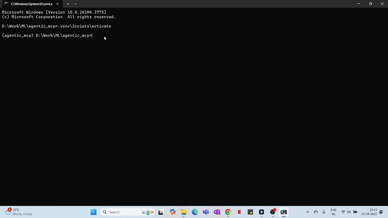
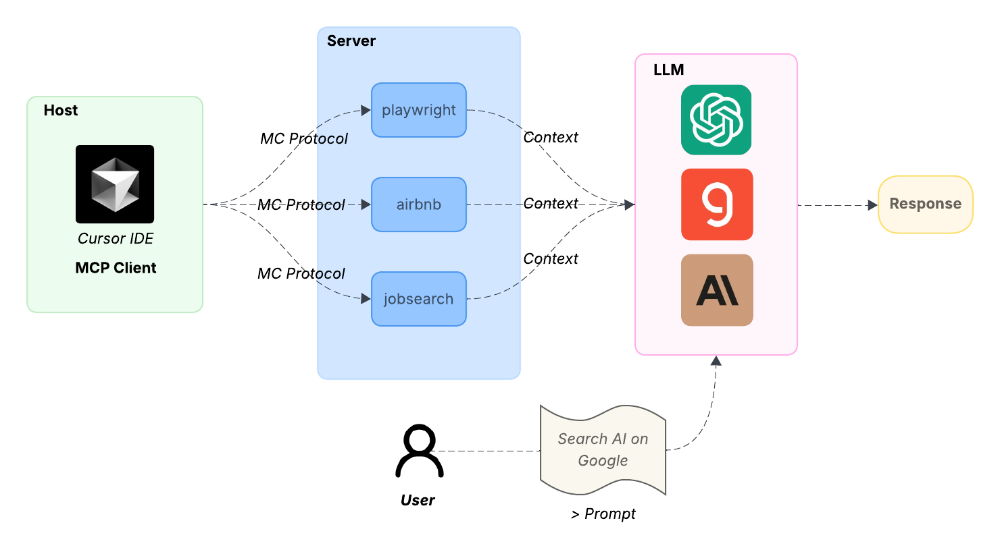

# 🧠 Model Context Protocol (MCP) - From Scratch

  
*A quick visual of the MCP in action.*

## 📘 Overview

Model Context Protocol (MCP) allows you to plug in server-generated context into an LLM (like OpenAI or Groq) to create dynamic, context-aware responses.  
This project demonstrates a basic MCP use case using Cursor IDE and `uv` as the package manager.

---

  

You can read my [Medium post](https://medium.com/@vikrampande783/building-model-context-protocol-from-scratch-cbe06e27a18e) for detailed implementation.